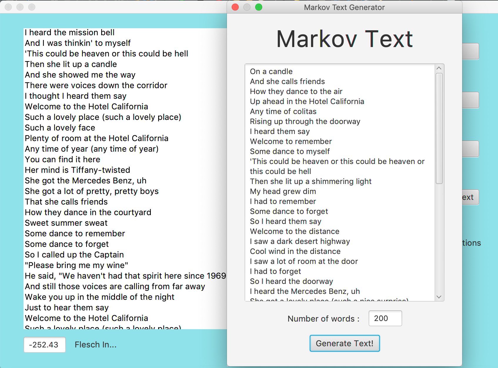
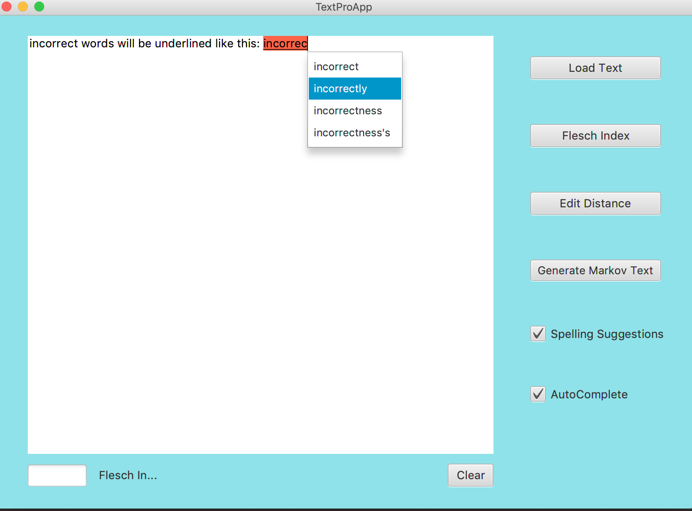

# Markov Chain Generator with Spelling Help
## Description
This is a java application developed with JavaFX. The application is combination of a Markov Chain text generator and text editor, that allow user to type or inport local txt files.

## Features
Calculate the Flesch Index Score (reading difficulty level) of the input text
- The Flesch Index score is calculated based on the input text's number of sentences, words and syllabus

Generate Markov Chain Text
- The Markov Chain text imitates the origin text's pattern and can produce "similar" text passages that are close to the original text's Flesch Index Score

Spelling check and spelling suggestion.

## Screenshots

    
    

